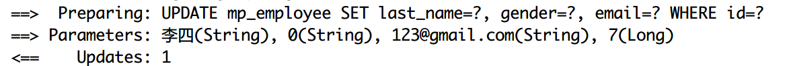
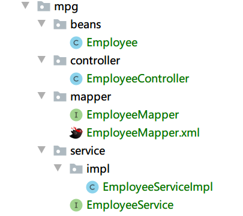

# MyBatis-Plus

## 简介

Mybatis-plus本质上是Mybatis的增强插件，为了简化开发和提高开发效率而生

**特性**

- **无侵入**：只做增强不做改变，引入它不会对现有工程产生影响，如丝般顺滑
- **强大的 CRUD 操作**：内置通用 Mapper、通用 Service，仅仅通过少量配置即可实现单表大部分 CRUD 操作，更有强大的条件构造器，满足各类使用需求
- **支持 Lambda 形式调用**：通过 Lambda 表达式，方便的编写各类查询条件，无需再担心字段写错
- **支持主键自动生成**：支持多达 4 种主键策略（内含分布式唯一 ID 生成器 - Sequence），可自由配置，完美解决主键问题
- **内置代码生成器**：采用代码或者 Maven 插件可快速生成 Mapper 、 Model 、 Service 、 Controller 层代码，支持模板引擎，更有超多自定义配置等您来使用
- **内置分页插件**：基于 MyBatis 物理分页，开发者无需关心具体操作，配置好插件之后，写分页等同于普通 List 查询
- **分页插件支持多种数据库**：支持 MySQL、MariaDB、Oracle、DB2、H2、HSQL、SQLite、Postgre、SQLServer 等多种数据库
- **内置性能分析插件**：可输出 Sql 语句以及其执行时间，建议开发测试时启用该功能，能快速揪出慢查询


## SpringBoot集成配置

### 数据库配置

准备好数据库中的表和测试数据

```sql
# 创建数据表
DROP TABLE IF EXISTS `mp_employee`;

CREATE TABLE `mp_employee`
(
    `id`        bigint(20) NOT NULL PRIMARY KEY AUTO_INCREMENT COMMENT '主键',
    `last_name` varchar(50) COMMENT '名称',
    `email`     varchar(50) COMMENT 'Email邮箱',
    `gender`    char(1) COMMENT '性别：0-男，1-女',
    `age`       int
) ENGINE = InnoDB
  DEFAULT CHARSET = utf8;

#  插入测试数据
INSERT INTO mp_employee(last_name, email, gender, age)
VALUES ('Tom', 'tom@qq.com', 0, 22);

INSERT INTO mp_employee(last_name, email, gender, age)
VALUES ('James', 'james@qq.com', 0, 18);

INSERT INTO mp_employee(last_name, email, gender, age)
VALUES ('july', 'july@qq.com', 1, 29);

INSERT INTO mp_employee(last_name, email, gender, age)
VALUES ('jane', 'jane@qq.com', 1, 16);

INSERT INTO mp_employee(last_name, email, gender, age)
VALUES ('black', 'black@qq.com', 0, 25);

INSERT INTO mp_employee(last_name, email, gender, age)
VALUES ('white', 'white@qq.com', 1, 24);
```


### 创建对应的JavaBean

在`com.hitopop.entity`包中创建实体类`Employee.java`

```java
@Data
@TableName("mp_employee")
public class Employee {
    /**
     * 主键
     */
    @TableId(type = IdType.AUTO)
    private Long id;

    /**
     * 名称
     */
    @TableField("last_name")
    private String lastName;

    /**
     * Email邮箱
     */
    private String email;

    /**
     * 性别：0-男，1-女
     */
    private String gender;

    /**
     * 名称
     */
    private Integer age;
}
```

`@TableName`指定了实体类对应的数据库表名

`@TableId`指引属性为数据库的主键，而且指定了type为auto自增加，Mybatis-Plus会为我们自动将插入数据库的主键注入到对象中去

`@TableFiled`是用在当数据库的字段名和Java实体类字段名称不同时用来对应的


### 引入依赖

`pom.xml`中引入Mybatis-plus插件的相关依赖，除了需要的配置之外，还需要lombok和mysql连接等依赖

```xml
 <dependencies>
        <dependency>
            <groupId>org.springframework.boot</groupId>
            <artifactId>spring-boot-starter</artifactId>
        </dependency>
        <dependency>
            <groupId>com.baomidou</groupId>
            <artifactId>mybatis-plus-boot-starter</artifactId>
            <version>3.3.1</version>
        </dependency>
        <dependency>
            <groupId>mysql</groupId>
            <artifactId>mysql-connector-java</artifactId>
        </dependency>
        <dependency>
            <groupId>org.projectlombok</groupId>
            <artifactId>lombok</artifactId>
            <optional>true</optional>
        </dependency>
        <dependency>
            <groupId>org.springframework.boot</groupId>
            <artifactId>spring-boot-starter-test</artifactId>
            <scope>test</scope>
        </dependency>
    </dependencies>
```

> 引入mybatis-plus-boot-starter之外不需要再单独引入Mybatis和Mybatis和spring的整合包了，mybatis-plus帮我们管理了这些依赖


### 添加配置

`application.yml`中配置数据源等信息

```yaml
spring:
  datasource:
    driver-class-name: com.mysql.cj.jdbc.Driver
    username: root
    password: root
    url: jdbc:mysql://127.0.0.1:3306/springboot-mybatis?characterEncoding=utf8&useUnicode=true&serverTimeZone=Asia/Shanghai
    
mybatis-plus:
  configuration:
    log-impl: org.apache.ibatis.logging.stdout.StdOutImpl
```

上次已经说过了，要使用最新的com.mysql.cj.jdbc.Driver驱动器

log-impl配置是为了在控制台中看到sql语句


### 插件通用配置

在`application.yml`中可以配置很多和插件有关的信息

常见的有：

```yaml
mybatis-plus:
  # 输出sql语句
  configuration:
    log-impl: org.apache.ibatis.logging.stdout.StdOutImpl
   # sql映射文件位置
  mapper-locations: classpath:mapper/**/*.xml
  # 全局数据配置
  global-config:
    db-config:
      # 数据表的主键生成策略
      id-type: auto
      # 表的前缀
      table-prefix: tb_
```


## 通用CRUD操作

此时我们已经有了`mp_empolyee`表，如果想要使用最基本的CRUD操作，以前使用Mybatis时我们是怎么做的呢？

1. 编写EmployeeMapper接口，在接口中定义Dao层的接口
2. 编写EmployeeMapper接口对应的EmployeeMapper.xml文件，手动编写接口中定义的sql语句

当程序中的实体类越来越多的时候就会发现这样对每个表的最简单的CRUD操作都手动写sql语句是很累的一件事。


### 编写接口

基于Mybatis-Plus，我们如果只需要最简单的CRUD操作，我们只需要在创建出的Mapper接口中继承BaseMapper接口即可获得基本的CRUD方法

在`com.hitopo.mapper`中创建出`EmployeeMapper.java`接口

```java
public interface EmployeeMapper extends BaseMapper<Employee> {
}
```

这个接口中并不需要有任何方法，所有的简单CRUD操作全部都在BaseMapper中存在了，当然，如果你想要有一些自定义的方法，也可以在该接口中定义


### 基本配置

写好接口类之后需要让spring帮我们管理这个接口，只需要在Application.java的主启动类上面添加`@MapperScan`注解扫描接口类

```java
@SpringBootApplication
@MapperScan("com.hitopo.mapper")
public class SpringbootMybatisPlusApplication {

    public static void main(String[] args) {
        SpringApplication.run(SpringbootMybatisPlusApplication.class, args);
    }

}
```


### 测试

#### 查询

```java
@Test
public void testSelect() {
    // 根据主键查询单个对象
    Employee employee = employeeMapper.selectById(3L);
    log.info("selectById(),employee={}", employee);
    log.info("--------------------");

    // 查询所有列表
    List<Employee> employeeList1 = employeeMapper.selectList(null);
    log.info("selectList(),employeeList1={}", employeeList1);
    log.info("--------------------");

    //查询所有指定id的数据
    List<Long> ids = new ArrayList<>();
    ids.add(2L);
    ids.add(3L);
    ids.add(5L);
    List<Employee> employeeList2 = employeeMapper.selectBatchIds(ids);
    log.info("selectBatchIds(),employeeList2={}", employeeList2);
    log.info("--------------------");

    // 查询单个记录
    // 如果查询出来的不是一条记录会报错
    Employee tom = employeeMapper.selectOne(new QueryWrapper<Employee>().eq("last_name", "Tom"));
    log.info("selectOne(),employee={}", tom);
    log.info("--------------------");

    // 根据条件查询，条件封装在Map中
    Map<String, Object> map = new HashMap<>();
    map.put("last_name", "James");
    map.put("age", 18);
    List<Employee> james = employeeMapper.selectByMap(map);
    log.info("selectByMap(),employee={}", james);
    log.info("--------------------");
}
```

上面的查询操作中很多时候需要查询参数时可以使用`selectByMap`，但是Map的只能封装相等条件，后面会说如何封装查询参数


#### 保存

```java
@Test
public void testSave() {
    // 待保存的记录，注意此时没有创建主键和email属性
    Employee employee = new Employee();
    employee.setLastName("张三");
    employee.setAge(12);
    employee.setGender("1");
    int result = employeeMapper.insert(employee);
    log.info("保存成功，受影响的行数是：{}", result);
    log.info("employee.getId():{}", employee.getId());
}
```

insert只有一个方法，在实体类中配置主键的类型是idType.auto之后插入数据库之后，Mybatis-Plus插件会自动帮我们回写id属性到employee对象中，


观察sql语句，发现保存的employee中属性为null的的email发送的sql语句中并没有包括，这就是动态的特性

这里又引入了一个话题：**既然插件是用null来帮我们判断是否需要插入某个字段，那么在实体类中最好不要使用基本数据类型，如int，boolean等，因为它们存在默认值，int的默认值是0，boolean的默认值的false。**

**应该使用它们的包装类Integer和Boolean，它们默认值就是null。基本数据类型没有赋值也会存在值，插件不好判断到底该属性是实际存在还是本来就是默认值不应该存在，导致歧义。**


#### 更新

```java
@Test
public void testUpdate() {
    Employee employee = new Employee();
    employee.setId(7L);
    employee.setLastName("李四");
    employee.setGender("0");
    employee.setEmail("123@gmail.com");
    int result = employeeMapper.updateById(employee);
    log.info("受影响的行数是：{}", result);
}
```

同理，根据id更新记录时候，不存在employee对象中的属性age在发送的更新的sql语句中不会存在，该函数返回值同样是受影响的行数




#### 删除

```java
@Test
public void testDelete() {
    int result1 = employeeMapper.deleteById(6L);
    int result2 = employeeMapper.deleteBatchIds(Arrays.asList(2L, 4L));
    Map<String, Object> map = new HashMap<>();
    map.put("age", 12);
    int result3 = employeeMapper.deleteByMap(map);
    log.info("deleteById()受影响的行数:{}", result1);
    log.info("deleteBatchIds()受影响的行数:{}", result2);
    log.info("deleteByMap()受影响的行数:{}", result3);

}
```


#### 总结

以上还有一些方法没有列出测试是因为它们都是用了条件查询对象QueryWrapper作为参数传递，统一放到下一章节，从上面简单的CRUD操作中就可以看出，我们不需要手写任何的sql语句就可以实现简单的CRUD操作，实在是方便。


## 条件构造器

> QueryWrapper(LambdaQueryWrapper) 和 UpdateWrapper(LambdaUpdateWrapper) 的父类
> 用于生成 sql 的 where 条件, entity 属性也用于生成 sql 的 where 条件
> 注意: entity 生成的 where 条件与 使用各个 api 生成的 where 条件**没有任何关联行为**

|  查询方式  |                   说明                   |
| :--------: | :--------------------------------------: |
|   allEq    |                基于map的=                |
|     eq     |                   等于                   |
|     ne     |                  不等于                  |
|     gt     |                   大于                   |
|     lt     |                   小于                   |
|     ge     |                 大于等于                 |
|     le     |                 小于等于                 |
|  between   |            在某两个数的区间内            |
| notBetween |           不在某两个值的区间内           |
|    like    |                 模糊匹配                 |
|  not like  |                 模糊匹配                 |
|     in     |               在某个区间内               |
|  groupBy   |                   分组                   |
|  orderBy   |                   排序                   |
|     or     |                   或者                   |
|    and     |                    且                    |
|   apply    | 在sql语句最后拼接（可能有sql注入的风险） |

以上就是常见的一些方法，还有一些没有列出，可以看官方文档

[https://mp.baomidou.com/guide/wrapper.html#service-java](https://mp.baomidou.com/guide/wrapper.html#service-java)


使用上述的方法就是在需要使用`QueryWrapper`或者`UpdateWrapper`的时候使用`new QueryWrapper<>().eq().ne().groupBy()`这样


### 整合测试

```java
@Test
public void testConditionalOps() {
    // 条件查询
    List<Employee> list = employeeMapper.selectList(new QueryWrapper<Employee>().between("age", 12, 25));
    log.info("selectList()，年龄在12-25的职工列表：{}", list);

    // 条件删除
    int result = employeeMapper.delete(new QueryWrapper<Employee>().eq("last_name", "张三"));
    log.info("delete(),删除lastname是张三的记录");

    // 条件修改
    Employee employee = new Employee();
    employee.setAge(20);
    employeeMapper.update(employee, new UpdateWrapper<Employee>().like("email", "@qq.com"));
    log.info("update(),修改email中包含@qq.com字符串的记录的年龄为20");

}
```


## 插件

### 分页插件

只需要在spring容器中注入PaginationInterceptor，对paginationInterceptor进行配置即可使用

在`com.hitopo.config`中创建`MybatisPlusConfig.java`

```java
@Configuration
public class MybatisPlusConfig {

    @Bean
    public PaginationInterceptor paginationInterceptor() {
        PaginationInterceptor interceptor = new PaginationInterceptor();
        // 设置请求的页面大于最大页后操作， true调回到首页，false 继续请求  默认false
        // paginationInterceptor.setOverflow(false);
        // 设置最大单页限制数量，默认 500 条，-1 不受限制
        interceptor.setLimit(500);
        // 开启 count 的 join 优化,只针对部分 left join
        interceptor.setCountSqlParser(new JsqlParserCountOptimize(true));
        return interceptor;
    }
}
```

这样之后使用selectPage方法就可以实现分页的效果了

```java
@Test
public void testPage() {
    IPage<Employee> iPage = employeeMapper.selectPage(new Page<>(2, 3), null);
    log.info("数据：{}", iPage.getRecords());
    log.info("当前页：{}", iPage.getCurrent());
    log.info("页的大小：{}", iPage.getSize());
    log.info("总页数：{}", iPage.getPages());
    log.info("总记录数：{}", iPage.getTotal());
}
```


## 代码生成工具

AutoGenerator 是 MyBatis-Plus 的代码生成器，通过 AutoGenerator 可以快速生成 Entity、Mapper、Mapper XML、Service、Controller 等各个模块的代码，极大的提升了开发效率。

AutoGenerator提供了大量自定义设置，生成的代码都是基于Java代码来生成的

### 

### 添加依赖

MyBatis-Plus 从 `3.0.3` 之后移除了代码生成器与模板引擎的默认依赖，需要手动添加相关依赖：

```xml
<dependency>
    <groupId>com.baomidou</groupId>
    <artifactId>mybatis-plus-generator</artifactId>
    <version>3.2.0</version>
</dependency>
<!--模板引擎-->
 <dependency>
     <groupId>org.apache.velocity</groupId>
     <artifactId>velocity-engine-core</artifactId>
     <version>2.2</version>
</dependency>
```


### 配置生成器

```java
@Test
public void testGenerator() {
    // 创建代码生成器
    AutoGenerator generator = new AutoGenerator();

    // 全局配置
    GlobalConfig globalConfig = new GlobalConfig();
    globalConfig.setActiveRecord(true) // 支持AR模式
        .setAuthor("hitopo") // 设置作者
        .setOutputDir("C:\\Users\\Administrator\\Desktop\\springboot-learn\\springboot-mybatis-plus\\src\\main\\java") // 输出主目录
        .setFileOverride(true) // 覆盖文件
        .setIdType(IdType.AUTO) //  主键类型
        .setServiceName("%sService") // 生成的service名称，默认是IEmployeeService，这样改成EmployeeService
        .setBaseResultMap(true) // 设置XML文件中生成基本的ResultMap
        .setBaseColumnList(true); //  设置生成sql片段
    generator.setGlobalConfig(globalConfig);

    // 数据源配置
    DataSourceConfig dataSourceConfig = new DataSourceConfig();
    dataSourceConfig.setDbType(DbType.MYSQL)
        .setDriverName("com.mysql.cj.jdbc.Driver")
        .setUsername("root")
        .setPassword("root")
        .setUrl("jdbc:mysql://127.0.0.1:3306/springboot-mybatis?useUnicode=true&characterEncoding=utf8&serverTimezone=Asia/Shanghai");
    generator.setDataSource(dataSourceConfig);

    // 策略配置
    StrategyConfig strategyConfig = new StrategyConfig();
    strategyConfig.setCapitalMode(true) // 全局大写命名
        .setNaming(NamingStrategy.underline_to_camel) // 数据库表映射到实体的命名策略
        .setTablePrefix("mp_") // 表的前缀
        .setInclude("mp_employee"); // 设置需要生成的表
    generator.setStrategy(strategyConfig);

    // 包名的生成配置
    PackageConfig packageConfig = new PackageConfig();
    packageConfig.setParent("com.hitopo.mpg") // 父包名
        .setMapper("mapper") // Dao层包名
        .setService("service") // service层包名
        .setController("controller") // controller层包名
        .setEntity("beans") // 实体类包名
        .setXml("mapper"); // 映射文件位置
    generator.setPackageInfo(packageConfig);

    // 执行生成器
    generator.execute();
}
```

此时运行该测试，会在指定的位置生成自动生成的代码：



这里生成的EmpolyeeServiceImpl继承了ServiceImpl

1. 在ServiceImpl中已经完成了Mapper对象的注入，直接在EmpolyeeServiceImpl中使用baseMapper即可，不需要自己再进行注入
2. 在ServiceImpl中也帮我们提供了常用的CRUD方法，基本的CRUD在Service中也不需要再自己写方法


## 逻辑删除

**配置更改**

```yaml
mybatis-plus:
  global-config:
    db-config:
      logic-delete-field: flag  #全局逻辑删除字段值 3.3.0开始支持，详情看下面。
      logic-delete-value: 1 # 逻辑已删除值(默认为 1)
      logic-not-delete-value: 0 # 逻辑未删除值(默认为 0)
```

局部配置：实体类的字段上添加`@TableLogic`注解，此方式会覆盖全局配置，如果没有注解，则会默认使用全局配置，

**注意：**

配置逻辑删除之后，再使用Mybatis-Plus提供的删除和查询功能都会自动带上逻辑存在的字符。

也就是说，查询没有添加条件时默认只能查询到未删除记录，删除也转变成了Update语句，如果想要得到所有的记录或者想要拿到逻辑上删除的字段，只能自己写sql语句。