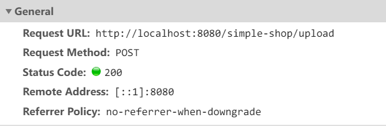
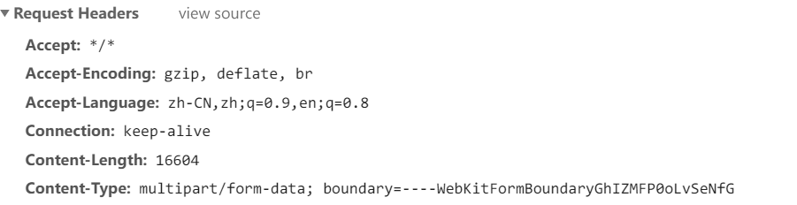

# 项目简介

该项目是在学习了SpringBoot的简单入门和SpringBoot整合Mybatis、Mybatis-Plus插件之后的练手项目

项目实现了用户登录、用户注册；商品的增删改查，商品照片的上传、回显和展示。

项目的技术栈：

* 后端：SpringBoot、Mybatis、Mybatis-Plus
* 前端： Vue + ElementUI

项目的仓库地址：[https://github.com/hitopo/springboot-learn/tree/master/springboot-vue-crud](https://github.com/hitopo/springboot-learn/tree/master/springboot-vue-crud)


# 准备

## 数据库

创建数据库`springboot-vue-crud`，执行`db`文件夹之下的sql文件创建出数据库和测试数据


##  导入依赖

```xml
 <dependencies>
        <dependency>
            <groupId>org.springframework.boot</groupId>
            <artifactId>spring-boot-starter-jdbc</artifactId>
        </dependency>
        <dependency>
            <groupId>org.springframework.boot</groupId>
            <artifactId>spring-boot-starter-web</artifactId>
        </dependency>

        <dependency>
            <groupId>org.springframework.boot</groupId>
            <artifactId>spring-boot-starter-test</artifactId>
            <scope>test</scope>
        </dependency>
        <!--mybatis-plus插件-->
        <dependency>
            <groupId>com.baomidou</groupId>
            <artifactId>mybatis-plus-boot-starter</artifactId>
            <version>3.3.1</version>
        </dependency>
        <!--mysql连接-->
        <dependency>
            <groupId>mysql</groupId>
            <artifactId>mysql-connector-java</artifactId>
            <scope>runtime</scope>
        </dependency>
        <!--spring aop支持-->
        <dependency>
            <groupId>org.springframework.boot</groupId>
            <artifactId>spring-boot-starter-aop</artifactId>
        </dependency>
        <!--阿里巴巴druid连接池-->
        <dependency>
            <groupId>com.alibaba</groupId>
            <artifactId>druid-spring-boot-starter</artifactId>
            <version>1.1.13</version>
        </dependency>
        <!--开发热部署插件-->
        <dependency>
            <groupId>org.springframework.boot</groupId>
            <artifactId>spring-boot-devtools</artifactId>
        </dependency>
        <!--引入Thymeleaf模板-->
        <dependency>
            <groupId>org.springframework.boot</groupId>
            <artifactId>spring-boot-starter-thymeleaf</artifactId>
        </dependency>
     	<!--文件上传依赖-->
      <dependency>
            <groupId>commons-io</groupId>
            <artifactId>commons-io</artifactId>
            <version>2.4</version>
        </dependency>
        <dependency>
            <groupId>commons-fileupload</groupId>
            <artifactId>commons-fileupload</artifactId>
            <version>1.2.2</version>
        </dependency>
    </dependencies>

```


## 配置

`application.yml`中添加目前需要的配置

- 服务器端口、项目路径设置
- 数据源设置
- thymeleaf模板设置
- Mybatis-Plus插件全局配置

```yaml
server:
  port: 8080
  servlet:
    context-path: /simple-shop

spring:
  datasource:
    # 基本配置
    driver-class-name: com.mysql.cj.jdbc.Driver
    username: root
    password: root
    url: jdbc:mysql://127.0.0.1:3306/springboot-vue-crud?characterEncoding=utf8&useUnicode=true
    
  # 模板设置
  thymeleaf:
    prefix: classpath:/templates/
    check-template-location: true
    suffix: .html
    encoding: utf-8
    mode: HTML
    cache: false
    
# mybatis-plus插件配置
mybatis-plus:
  # 输出sql语句
  configuration:
    log-impl: org.apache.ibatis.logging.stdout.StdOutImpl
  mapper-locations: classpath:mapper/**/*.xml
  global-config:
    db-config:
      id-type: auto
      table-prefix: tb_
```


## 代码生成

代码生成是复用上一篇学习Mybatis-Plus那时候的代码，略微做出改动即可使用


## 统一封装返回的数据格式

项目返回的json数据全部固定为指定格式：

```json
{
    "code":200,
    "msg":请求成功
    "daat":{}
}
```

在`com.hitopo.common`中创建出统一管理返回码和返回消息的枚举类`ResultEnum.java`

```java
public enum ResultEnum {

   
    // 通用返回格式
    SUCCESS(200, "请求成功"),
    CREATED(201, "创建成功"),
    DELETED(204, "删除成功"),
    BAD_REQUEST(400, "请求地址不存在或者包含不支持的参数"),
    INNER_ERROR(500, "服务器错误"),

    // 自定义返回的错误格式
    // 用户部分
    NOT_EXIST_USER_OR_ERROR_PASSWORD(10001, "用户名或者密码错误！"),
    USERNAME_ALREADY_EXIST(10002, "用户名已经存在！"),

    // 文件上传部分
    FILE_IS_EMPTY(20001, "上传的文件不能为空！"),
    FILE_UPLOAD_ERROR(20002, "文件上传失败！");


    /**
     * 状态码
     */
    private Integer code;
    /**
     * 状态参数
     */
    private String msg;

    ResultEnum(Integer code, String msg) {
        this.code = code;
        this.msg = msg;
    }
	// ..getter、setter..
}
```

为了封装统一的返回json格式，创建出`R.java`固定返回格式，之后凡是需要用到返回json的格式的情况，统一返回R对象

```java
public class R {
     /**
     * 状态码
     */
    private Integer code;
    /**
     * 状态数据
     */
    private String msg;
    /**
     * 数据
     */
    private Object data;

    public R() {
    }

    private R(Integer code, String msg) {
        this.code = code;
        this.msg = msg;
    }

    private R(Integer code, String msg, Object data) {
        this.code = code;
        this.msg = msg;
        this.data = data;
    }

    public static R create(Integer code, String msg) {
        return new R(code, msg);
    }

    public static R create(Integer code, String msg, Object data) {
        return new R(code, msg, data);
    }

    public static R create(ResultEnum re) {
        return new R(re.getCode(), re.getMsg());
    }

    public static R create(ResultEnum re, Object data) {
        return new R(re.getCode(), re.getMsg(), data);
    }
   // ..getter、setter..
}
```

封装统一的自定义异常对象，这样就可以在统一的Controller中统一处理异常

```java
public class CustomizedException extends RuntimeException {

    private Integer code;

    public CustomizedException(Integer code, String message) {
        super(message);
        this.code = code;
    }

    public CustomizedException(ResultEnum re){
        super(re.getMsg());
        this.code = re.getCode();
    }

    public Integer getCode() {
        return code;
    }

    public void setCode(Integer code) {
        this.code = code;
    }
}
```

统一的异常处理类`MyExceptionHandler`处理所有的自定义异常和其他异常，返回给前端以统一的格式

```java
@RestControllerAdvice
public class MyExceptionHandler {

    /**
     * 处理用户异常
     * @param e 自定义异常异常
     */
    @ExceptionHandler(CustomizedException.class)
    public R handleUserException(CustomizedException e) {
        // 封装异常信息成R
        return R.create(e.getCode(), e.getMessage());
    }

    /**
     * 通用异常处理方法
     * @return
     */
    @ExceptionHandler(Exception.class)
    public R handleException() {
        //返回服务器内部错误
        return R.create(ResultEnum.INNER_ERROR);
    }
}
```


# 用户管理

## 用户登录检测

用户登录和注册功能很简单，不细说。

重点说一下登录拦截的实现，因为权限管理的框架暂时还没有学到，暂时使用Spring AOP简单实现用户的登录与否的验证：

- 如果没有登录的情况下，只能访问部分接口，访问受保护的接口全部重定向到登录界面
- `@Pointcut`注解指定了一个切面表达式，在切面表达式中使用`within`指定了只对外暴露`LoginController`中的接口，而保护所有的其他Controller中定义的接口
- 切面中定义了一个环绕通知，在环绕通知中检查session中是否存在了用户名，是就放行，否则强制跳转到登录界面

```java
@Aspect
@Component
public class LoginInterceptor {

    private final Logger log = LoggerFactory.getLogger(LoginInterceptor.class);

    @Pointcut("within(com.hitopo.controller..*) && !within(com.hitopo.controller.LoginController)")
    public void pointcut() {
    }

    @Around("pointcut()")
    public Object trackInfo(ProceedingJoinPoint joinPoint) throws Throwable {
        ServletRequestAttributes attributes = (ServletRequestAttributes) RequestContextHolder.getRequestAttributes();
        HttpServletRequest request = attributes.getRequest();
        String username = (String) request.getSession().getAttribute("username");
        if (username == null) {
            log.info("***************用户未登录***************");
            // 跳转到登录界面
            attributes.getResponse().sendRedirect(request.getContextPath() + "/login");
        } else {
            log.info("***************用户已登录***************");
        }
        // 这里一定要返回，否则会导致404错误
        return joinPoint.proceed();
    }
}
```


# 商品管理

## 商品文件上传管理

商品管理部分大多是一些增删改查的最基本的功能， 不细说，重点说一下文件上传功能


### 思路分析

图片文件的上传和表单提交是两个功能，对应不同的接口，一般来说，前端表单中的控件中绑定的数据也不会是整个图片，而是图片的url访问地址

1. 图片的上传时机？

    图片应该在前端点击文件上传并且选择了要上传的文件之后就调用后端接口上传文件，然后提交表单的时候再调用另一个后端接口提交数据，此时图片文件部分在表单中的表现形式就是url地址

2. 如何获得已经上传的图片的url地址？
    - 前端：像本项目中使用的ElementUI中文件组件中有`on-success`回调函数，一旦上传成功之后就会调用该函数，可以在这个回调函数中获取后端返回的图片url地址绑定到数据中
    - 后端：后端负责接收到用户上传的文件，保存到自己的文件服务器上或者调用第三方服务，保存到第三方的云中，返回图片的url地址


### 图片的回显

回显图片很简单，只需要在数据库中保存了正确图片url访问地址，在前端的table控件中使用``即可显示图片


### 前端实现

#### html

```html
  <el-upload
             ref="upload"
             action="/simple-shop/upload"
             multiple
             name="picture"
             list-type="picture-card"
             :limit="1"
             :on-exceed="onExceed"
             :file-list="fileList"
             :before-upload="beforeUpload"
             :on-success="handleSuccess"
             :on-remove="handleRemove">
</el-upload>
```

本项目中使用的是ElementUI中的el-upload控件，完全的控件使用方法见官方文档

这里简单介绍下项目中用到的参数

- **ref**：vue原生参数，用来给组件注册引入信息。引用信息会传递到父组件的`$refs`对象上。
- **action**：文件上传的后端接口
- **name**：文件上传的文件字段名
- **:limit**：最大允许上传文件个数
- **list-type**：ElementUI文件上传插件类型
- **on-exceed**：文件个数超过个数的钩子函数
- **:fileList**：上传的文件列表，这个参数在上传组件中回显图片，包含两个参数，`name`和`url`，在表单控件中想要显示图片，给这两个参数赋值即可
- **:beforeUpload**：文件上传前的钩子函数
- **:on-success**：文件上传成功之后的钩子函数
- **:on-remove**：移除文件的钩子函数


#### js

```js
 //文件上传成功的钩子函数
        handleSuccess(res, file, fileList) {
            this.$message({
                type: 'info',
                message: '图片上传成功',
                duration: 6000
            });
            this.editor.imageUrl = file.response.data.url; //将返回的图片访问url地址赋值imageUrl字段
            console.log(this.editor.imageUrl);
        },
        //删除文件之前的钩子函数
        handleRemove(file, fileList) {
            this.$message({
                type: 'info',
                message: '已删除原有图片',
                duration: 6000
            });
        },
        //上传的文件个数超出设定时触发的函数
        onExceed(files, fileList) {
            this.$message({
                type: 'info',
                message: '最多只能上传一个图片',
                duration: 6000
            });
        },
        //参数是上传的文件，若返回false，或返回Primary且被reject，则停止上传
        beforeUpload(file) {
            const isJPG = file.type === 'image/jpeg';
            const isGIF = file.type === 'image/gif';
            const isPNG = file.type === 'image/png';
            const isBMP = file.type === 'image/bmp';
            const isLt2M = file.size / 1024 / 1024 < 2;

            if (!isJPG && !isGIF && !isPNG && !isBMP) {
                this.$message.error('上传图片必须是JPG/GIF/PNG/BMP 格式!');
            }
            if (!isLt2M) {
                this.$message.error('上传图片大小不能超过 2MB!');
            }
            return (isJPG || isBMP || isGIF || isPNG) && isLt2M;
        }
```

从上面的js代码中可以看到一般在文件上传之前限制等待上传的文件的类型和大小，在文件上传完成之后赋值绑定文件的url，从而达到回显图片的效果。

需要注意的是，该空间上传文件的时候并不需要设置form表单的类型是`multipart/form-data`





控件会自动帮我们设置请求类型为`POST`，表单类型是`multipart/form-data`

服务器返回的json是：可以看到data属性中封装了图片的访问地址


### 后端

#### Controller

单独提取出了一个`UploadController`用来处理文件上传的参数

```java
@RestController
public class UploadController {

    @Autowired
    private UploadService uploadService;

    /**
     * 上传文件
     */
    @PostMapping("/upload")
    public R upload(@RequestParam("picture") MultipartFile picFile) {
        String urlPrefix = "http://127.0.0.1:8080/simple-shop";
        return uploadService.upload(picFile, urlPrefix);
    }
}
```


#### service

```java
  public R upload(MultipartFile picFile, String urlPrefix) {
        // 为了放置文件名重复，重新设置文件名
        String originalFileName = picFile.getOriginalFilename();
        // 文件类型
        String type = originalFileName.substring(originalFileName.lastIndexOf(".") + 1);
        // 生成新的文件名
        LocalDateTime dateTime = LocalDateTime.now();
        DateTimeFormatter formatter = DateTimeFormatter.ofPattern("yyyyMMddHHmmss");
        String fileName = dateTime.format(formatter) + "." + type;
        String uploadPath;
        try {
            // 上传文件
            uploadPath = FileUploadUtil.upload(picFile.getInputStream(), "images/", fileName);
        } catch (IOException e) {
            throw new CustomizedException(ResultEnum.FILE_UPLOAD_ERROR);
        }
        // uploadPath:/upload/image/test.jpg
        // 组装访问路径
        String url = urlPrefix + uploadPath;
        Map<String, Object> map = new HashMap<>();
        map.put("url", url);
        return R.create(ResultEnum.CREATED, map);
    }
```


#### 文件上传工具类

```java
public class FileUploadUtil {
    /**
     * 绝对路径
     **/
    private static String absolutePath = "";

    /**
     * 静态目录
     **/
    private static String staticDir = "static";

    /**
     * 文件存放的目录
     **/
    private static String fileDir = "/upload/";

    /**
     * 上传单个文件
     * 最后文件存放路径为：static/upload/image/test.jpg
     * 文件访问路径为：http://127.0.0.1:8080/upload/image/test.jpg
     * 该方法返回值为：/upload/image/test.jpg
     * @param inputStream 文件流
     * @param path        文件路径，如：image/
     * @param filename    文件名，如：test.jpg
     * @return 成功：上传后的文件访问路径，失败返回：null
     */
    public static String upload(InputStream inputStream, String path, String filename) throws IOException {
        //第一次会创建文件夹
        createDirIfNotExists();
        String resultPath = fileDir + path + filename;
        //存文件
        File uploadFile = new File(absolutePath, staticDir + resultPath);
        FileUtils.copyInputStreamToFile(inputStream, uploadFile);
        return resultPath;
    }

    /**
     * 创建文件夹路径
     */
    private static void createDirIfNotExists() {
        if (!absolutePath.isEmpty()) {
            return;
        }

        //获取跟目录
        File file = null;
        try {
            file = new File(ResourceUtils.getURL("classpath:").getPath());
        } catch (FileNotFoundException e) {
            throw new RuntimeException("获取根目录失败，无法创建上传目录！");
        }
        if (!file.exists()) {
            file = new File("");
        }
        absolutePath = file.getAbsolutePath();
        File upload = new File(absolutePath, staticDir + fileDir);
        if (!upload.exists()) {
            upload.mkdirs();
        }
    }

    /**
     * 删除文件
     * @param path 文件访问的路径upload开始 如： /upload/image/test.jpg
     * @return true 删除成功； false 删除失败
     */
    public static boolean delete(String path) {
        File file = new File(absolutePath, staticDir + path);
        if (file.exists()) {
            return file.delete();
        }
        return false;
    }
}
```

由于springboot使用的是嵌入式tomcat，所以获取到的项目地址每次启动都不相同，所以不能用`request.getSession().getServletContext().getRealPath("/upload")`获取地址

`ResourceUtils.getURL("classpath:").getPath()`是关键，可以获得maven项目的项目的类路径，

当然存储文件的地址也可以设置为本地磁盘的其他绝对路径。


